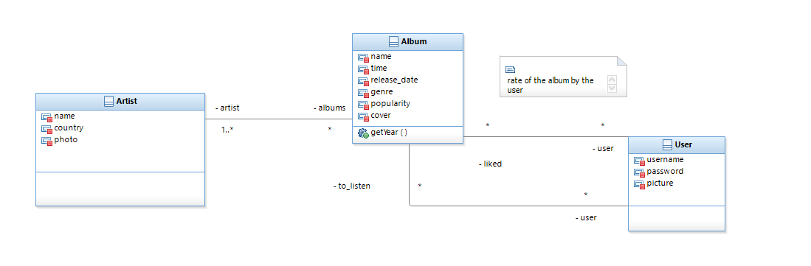
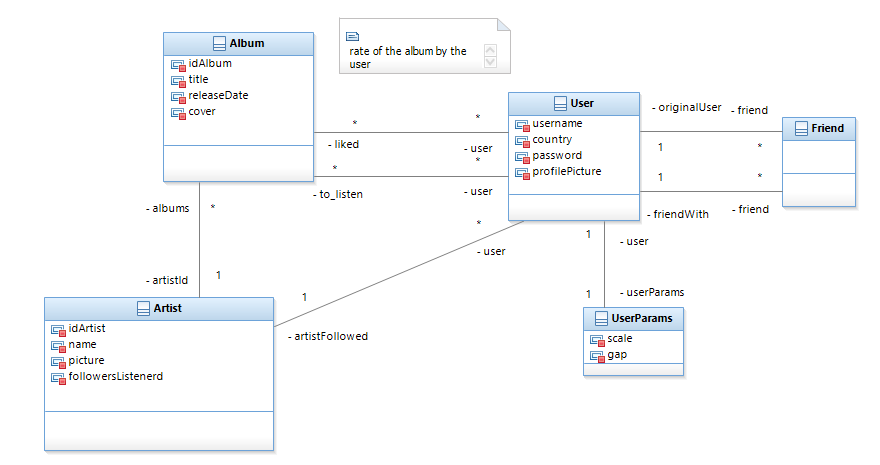

# Listenerd
TU Dublin - Web Applications Architectures WEB9810 - Individual project

How to run the application : 
To start the server, you need to have Node.js installed on your machine. You can download it from https://nodejs.org/

First, go to the project root (Listenerd) and install the dependencies with the command: npm install
You can do the same thing by going to the client folder and installing the dependencies with the command: npm install

Once this has been done, you can return to the project root and launch the web application and REST API server with the command: npm start

The web application is then accessible on localhost:8080 by default.

You can also launch mongodb in a terminal with the command: mongod.

A database dump is available in the root folder, named dump_listenerd.
To install it, you need to install the npm mongo-tools package: sudo apt install mongo-tools
And run the command: mongorestore --db Listenerd ./dump_listenerd/

In this database dump, you can use the following user accounts:
- Username: Gurwan, password: azerty
- Username: Jonathan, password: azerty123

The Gurwan account contains all my data, with just over 100 albums in the Liked albums list.

The Jonathan account is a little emptier, allowing you to quickly test the features.

First class diagram of the model :

Second class diagram of the model (for the Interim demo - 02/11/23):

Final class diagram of the model (for the Final demo - 27/11/23):
